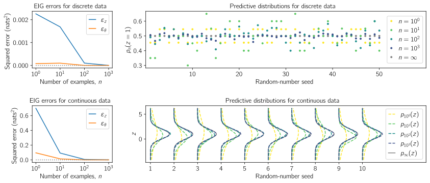

# Rethinking aleatoric and epistemic uncertainty

*Freddie Bickford Smith, Jannik Kossen, Eleanor Trollope, Mark van der Wilk, Adam Foster, Tom Rainforth*

The ideas of aleatoric and epistemic uncertainty are widely used to reason about the probabilistic predictions of machine-learning models.
We identify incoherence in existing discussions of these ideas and suggest this stems from the aleatoric-epistemic view being insufficiently expressive to capture all the distinct quantities that researchers are interested in.
To address this we present a decision-theoretic perspective that relates rigorous notions of uncertainty, predictive performance and statistical dispersion in data.
This serves to support clearer thinking as the field moves forward.
Additionally we provide insights into popular information-theoretic quantities, showing they can be poor estimators of what they are often purported to measure, while also explaining how they can still be useful in guiding data acquisition.


## Getting set up

Create an environment using [Mamba](https://mamba.readthedocs.io) (or [Conda](https://conda.io), replacing `mamba` with `conda` below) and activate it:

```bash
mamba env create --file environment.yaml && mamba activate uncertainty
```


## Demonstrating uncertainty and evaluation


### Code

```bash
python demo_uncertainty_and_evaluation.py
```


### Results

<div align="center">
	
</div>


## Demonstrating estimation errors associated with BALD


### Code

```bash
python demo_bald_estimation_errors.py
```


### Results

<div align="center">
	
</div>


## Getting in touch

Contact [Freddie](https://github.com/fbickfordsmith) if you have any questions about this research or encounter any problems using the code.


## Citing this work

```bibtex
@article{bickfordsmith2025rethinking,
    author = {{Bickford Smith}, Freddie and Kossen, Jannik and Trollope, Eleanor and {van der Wilk}, Mark and Foster, Adam and Rainforth, Tom},
    year = {2025},
    title = {Rethinking aleatoric and epistemic uncertainty},
    journal = {International Conference on Machine Learning},
}
```
